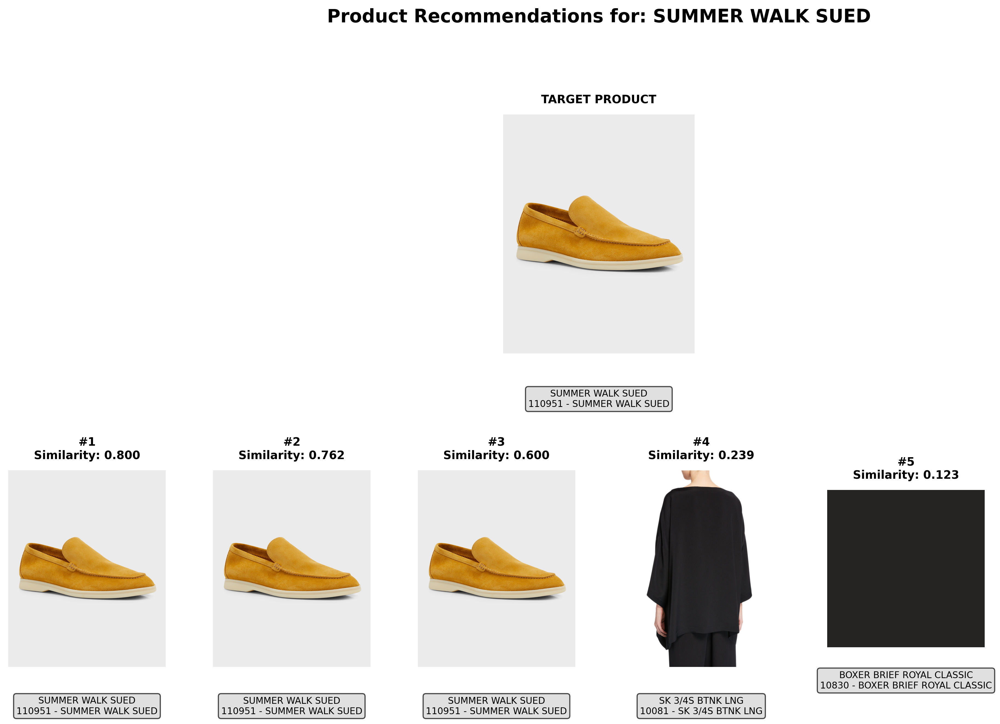

# Product Classification System

A comprehensive product analysis and recommendation system that works with JSON data files.

## 🚀 Quick Start

### 1. Install Dependencies
```bash
pip install -r requirements.txt
```

### 2. Configure Your Product Lists
Edit `examples/product_lists.txt` to add your JSON file paths:
```
# Product Lists Configuration
# Just add your JSON file paths - everything else is auto-detected!

C:\Users\YourName\Downloads\styles\product1.json
C:\Users\YourName\Downloads\styles\product2.json
```

### 3. Run Analysis
```bash
# Analyze all products
python src/multi_product_analyzer.py --product-lists-config examples/product_lists.txt

# Create tabular charts with Python visualizations
python src/tabular_product_analyzer.py --product-lists-config examples/product_lists.txt

# Get product recommendations with visual display
python src/product_recommender_json.py --config-file examples/product_lists.txt --analyze
python src/product_recommender_json.py --config-file examples/product_lists.txt --recommend "PRODUCT_ID_HERE"
```

## 📁 Project Structure

```
ProductClassification/
├── src/                          # Main source code
│   ├── json_data_loader.py       # JSON data loading utility
│   ├── multi_product_analyzer.py # Multi-file product analyzer
│   ├── product_analyzer_from_file.py # Single file product analyzer
│   ├── product_analyzer_json.py  # JSON-based product analyzer
│   ├── tabular_product_analyzer.py # Tabular chart generator
│   ├── product_recommender_json.py # Visual product recommendation system
│   ├── image_classifier_json.py  # Image classification
│   ├── combined_classifier_json.py # Combined text + image classifier
│   ├── simple_text_classifier.py # Text classification
│   ├── basic_text_analyzer.py    # Basic text analysis
│   ├── categorize_words_json.py  # Word categorization
│   ├── images/                   # Cached product images and recommendation visualizations
│   │   ├── product images (7 files) # Downloaded product images
│   │   └── recommendations_*.png # Visual recommendation charts
│   ├── 10045_401097928176_analysis.txt # Generated analysis report
│   └── product_analysis_charts.xlsx # Generated Excel charts
├── examples/                     # Example files and configurations
│   ├── product_lists.txt        # Your product lists configuration
│   ├── example_product_lists.txt # Example configuration template
│   ├── run_analysis.py          # Example analysis script
│   ├── run_examples.bat         # Windows batch file for examples
│   ├── analysis_results.txt     # Example analysis output
│   ├── comprehensive_analysis.xlsx # Example Excel output
│   ├── comprehensive_analysis_updated.xlsx # Updated example
│   └── comprehensive_analysis_with_python_charts.xlsx # Python charts example
├── results/                      # Legacy analysis results
│   ├── categories.txt           # Category data
│   ├── image-classification-top500-errors.html # Image classification errors
│   └── text-classification-top500-errors.html # Text classification errors
├── architecture/                 # System architecture documentation
│   ├── system_architecture.md   # Main architecture overview
│   ├── component_diagram.md     # Component interactions
│   └── data_flow.md            # Data flow documentation
├── requirements.txt             # Python dependencies
├── config.env.example          # Environment configuration template
└── README.md                   # This documentation file
```

## 🎯 Main Features

### 📊 **Product Analysis**
- **Multi-file Analysis**: Analyze multiple JSON files simultaneously
- **Comprehensive Metrics**: Extract 15+ product attributes including sustainability, materials, style, pricing, brand analysis, dimensions, care instructions, target market, seasonal trends, quality assessment, and usage recommendations
- **Inventory Analysis**: Track SKU numbers, stock status, quantities, and locations

### 📈 **Visualization & Reporting**
- **Tabular Charts**: Generate comprehensive Excel reports with multiple sheets
- **Python Charts**: Interactive matplotlib visualizations including:
  - Stock Status Distribution
  - Price Range Analysis
  - Brand Tier Distribution
  - Sustainability Analysis (Yes/No counts)
  - Inventory Categories
  - Market Segment Analysis
- **Excel Export**: Professional Excel files with formatted data

### 🎨 **Product Recommendations**
- **Visual Display**: Show target product and 5 recommendations with images
- **Multiple Similarity Types**: Text-only, image-only, or combined similarity
- **Detailed Explanations**: Explain why products are similar
- **Image Processing**: Download and analyze product images automatically

### 🤖 **Classification Systems**
- **Text Classification**: Analyze product descriptions and names
- **Image Classification**: Extract visual features from product images
- **Combined Analysis**: Merge text and image features for comprehensive analysis
- **No TensorFlow Required**: Lightweight alternatives using scikit-learn and PIL

## 🔧 Configuration

### Environment Variables
Copy `config.env.example` to `config.env` and configure:
```
SHOPSTYLE_API_KEY=your_api_key_here
DATABASE_URL=sqlite:///crawl.db
```

### Product Lists Configuration
The `examples/product_lists.txt` file supports:
- Simple file path listing
- Automatic list name generation
- Auto-detection of categories and output files
- Comment support with `#`

## 📋 Usage Examples

### Analyze All Products
```bash
python src/multi_product_analyzer.py --product-lists-config examples/product_lists.txt
```

### Generate Comprehensive Charts
```bash
python src/tabular_product_analyzer.py --product-lists-config examples/product_lists.txt --output-file my_analysis.xlsx
```

### Get Product Recommendations
```bash
# First, analyze to see available products
python src/product_recommender_json.py --config-file examples/product_lists.txt --analyze

# Then get recommendations for a specific product
python src/product_recommender_json.py --config-file examples/product_lists.txt --recommend "productID" --top-k 5
```

### Text Classification
```bash
python src/simple_text_classifier.py --json-file path/to/your/products.json
```

### Image Classification
```bash
python src/image_classifier_json.py --json-file path/to/your/products.json
```

## 🎨 Visual Features

The recommendation system displays:
- **Target Product**: Large, centered display with image and description
- **5 Recommendations**: Side-by-side layout with similarity scores
- **Image Support**: Automatic image downloading and display
- **Fallback Handling**: Placeholder images for missing or broken images
- **Professional Layout**: Clean, organized visual presentation

## 📊 Output Examples

### Analysis Results
- **Excel Reports**: Multi-sheet workbooks with comprehensive data (`src/product_analysis_charts.xlsx`)
- **Python Charts**: Interactive visualizations displayed in separate windows
- **Text Reports**: Detailed analysis summaries (`src/{list_name}_analysis.txt`)
- **Image Cache**: Automatically cached product images (`src/images/`)

### Recommendation Output
- **Visual Display**: Matplotlib-based product comparison
- **Similarity Scores**: Numerical similarity ratings
- **Explanations**: Detailed reasoning for recommendations
- **Product Details**: Names, descriptions, categories, and images
- **Saved Visualizations**: PNG files automatically saved to `src/images/` (e.g., `recommendations_prod261180192.png`)

## 🎯 Real Analysis Example

Here's an actual analysis output from the system analyzing 6 products:

## 🖼️ Visual Recommendation Examples

The product recommendation system generates visual comparisons and saves them as high-quality PNG files:

### **Example Recommendation Output**
When you run the recommendation system, it creates visualizations like:



### **Visual Layout**
- **Top Row**: Target product (large, centered display)
- **Bottom Row**: 5 recommended products with similarity scores
- **High Resolution**: 300 DPI PNG files for crisp display
- **Professional Layout**: Clean, organized presentation with product details

### **File Naming Convention**
- Format: `recommendations_{PRODUCT_ID}.png`
- Example: `recommendations_prod261180192.png`
- Location: `src/images/` directory
- Automatic: Generated every time you run recommendations

### 📋 **Sample Product Analysis:**

**🎯 PRODUCT: DRESSING FLORAL ITALIAN BRIEF**
- **ID**: prod285360089
- **Category**: Women
- **Materials**: cotton, polyester, nylon
- **Style**: floral design
- **Price**: mid-range ($120)
- **Brand**: Lise Charmel
- **Sustainability**: ❌ No (Score: 1/10)
- **Market**: mass market, budget conscious
- **Quality**: standard craftsmanship

**🎯 PRODUCT: SK 3/4S BTNK LNG**
- **ID**: prod205250129
- **Category**: Women
- **Materials**: silk
- **Style**: Daytime occasions
- **Price**: luxury ($1038)
- **Brand**: Eskandar
- **Sustainability**: ✅ Yes (Score: 3/10, sustainable materials: silk)
- **Market**: premium market
- **Quality**: high craftsmanship

### 📊 **Summary Statistics:**
- **Total Products**: 6
- **Sustainable Products**: 1/6 (16.7%)
- **Average Sustainability Score**: 2.0/10
- **Price Distribution**: 4 premium, 1 mid-range, 1 luxury
- **Quality Distribution**: 4 high quality, 2 unknown
- **Market Distribution**: 4 premium market, 1 mass market, 1 luxury market
- **Care Requirements**: 4 high maintenance, 2 unknown

### 🎨 **Analysis Features Demonstrated:**
✅ **Sustainability Analysis**: Identifies eco-friendly materials and practices
✅ **Material Extraction**: Detects primary materials (cotton, silk, polyester, nylon)
✅ **Price Analysis**: Categorizes products by price range and luxury level
✅ **Brand Analysis**: Identifies brand names and reputation scores
✅ **Market Segmentation**: Determines target demographics and market positioning
✅ **Quality Assessment**: Evaluates craftsmanship and construction quality
✅ **Care Instructions**: Provides maintenance recommendations
✅ **Style Analysis**: Identifies design elements and occasions
✅ **Dimensional Analysis**: Extracts size and weight information

## 🛠️ Dependencies

- **Core**: `numpy`, `pandas`, `matplotlib`, `seaborn`
- **Image Processing**: `Pillow`
- **Excel Export**: `openpyxl`
- **HTTP Requests**: `requests`
- **Database**: `sqlalchemy`
- **Machine Learning**: `scikit-learn` (optional)

## 📝 Notes

- **No TensorFlow Required**: System uses lightweight alternatives
- **JSON-Based**: Works directly with JSON product data files
- **Cross-Platform**: Works on Windows, macOS, and Linux
- **Extensible**: Easy to add new analysis features
- **Professional**: Clean, organized codebase with proper documentation

## 🚀 Getting Started

1. **Clone/Download** this repository
2. **Install dependencies**: `pip install -r requirements.txt`
3. **Configure product lists**: Edit `examples/product_lists.txt` with your JSON file paths
4. **Run analysis**: `python src/multi_product_analyzer.py --product-lists-config examples/product_lists.txt`
5. **View results**: 
   - Check `src/{list_name}_analysis.txt` for detailed text reports
   - Check `src/product_analysis_charts.xlsx` for comprehensive Excel data
   - View Python charts displayed in separate windows
   - Browse `src/images/` for cached product images
   - Check `src/images/recommendations_*.png` for visual recommendation charts

### 🎯 **Quick Test**
Run the example script: `python examples/run_analysis.py` or double-click `examples/run_examples.bat`

## 🏗️ Architecture Documentation

For detailed understanding of the system architecture:

- **[System Architecture](architecture/system_architecture.md)**: Complete system overview with component diagrams
- **[Component Interactions](architecture/component_diagram.md)**: Detailed component relationships and data flow
- **[Data Flow](architecture/data_flow.md)**: How data moves through the system from input to output

The architecture documentation includes:
- **Component Diagrams**: Visual representation of all system components
- **Data Flow Charts**: How data flows through the processing pipeline
- **Sequence Diagrams**: Step-by-step interaction flows
- **Technical Details**: Design patterns, scalability, and performance considerations

Enjoy analyzing your products! 🎉
