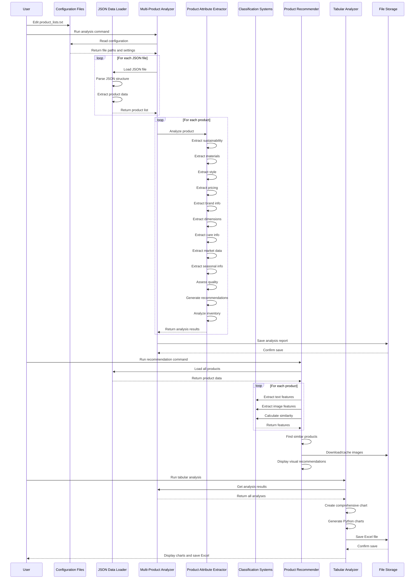
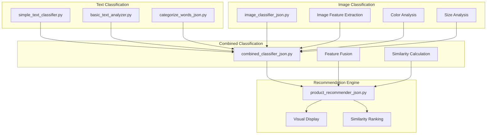

# Component Interaction Diagram

## 🔧 Detailed Component Interactions

This diagram shows the detailed interactions between all components in the Product Classification System.

## 🏗️ Component Architecture Details

### **Data Flow Layers**

```mermaid
graph LR
    subgraph "Input Layer"
        A[JSON Files] --> B[Configuration]
        B --> C[Environment]
    end
    
    subgraph "Processing Layer"
        D[Data Loader] --> E[Multi Analyzer]
        E --> F[Attribute Extractor]
    end
    
    subgraph "Analysis Layer"
        G[Sustainability] --> H[Materials]
        H --> I[Style]
        I --> J[Pricing]
        J --> K[Brand]
        K --> L[Dimensions]
        L --> M[Care]
        M --> N[Market]
        N --> O[Seasonal]
        O --> P[Quality]
        P --> Q[Recommendations]
        Q --> R[Inventory]
    end
    
    subgraph "Output Layer"
        S[Text Reports] --> T[Excel Files]
        T --> U[Python Charts]
        U --> V[Visual Recommendations]
    end
    
    C --> D
    F --> G
    R --> S
```

### **Classification System Architecture**

## 🔄 Processing Pipeline

### **Stage 1: Data Ingestion**
1. **Configuration Reading**: Parse product lists and settings
2. **JSON Loading**: Load and parse product data files
3. **Data Validation**: Check data integrity and structure
4. **Product Extraction**: Extract individual product records

### **Stage 2: Feature Extraction**
1. **Text Processing**: Normalize and analyze product descriptions
2. **Image Processing**: Download and analyze product images
3. **Attribute Extraction**: Extract 12+ product attributes
4. **Feature Caching**: Store computed features for reuse

### **Stage 3: Analysis & Classification**
1. **Sustainability Analysis**: Assess environmental impact
2. **Material Analysis**: Identify and categorize materials
3. **Style Analysis**: Determine design characteristics
4. **Price Analysis**: Evaluate pricing and value
5. **Brand Analysis**: Assess brand reputation and tier
6. **Market Analysis**: Determine target demographics
7. **Quality Assessment**: Evaluate craftsmanship and quality

### **Stage 4: Output Generation**
1. **Report Generation**: Create detailed text reports
2. **Chart Creation**: Generate Python visualizations
3. **Excel Export**: Create comprehensive Excel files
4. **Recommendation Display**: Show visual product recommendations

## 🎯 Key Design Principles

### **Modularity**
- Each component has a single, well-defined responsibility
- Components can be used independently or together
- Easy to add new analysis modules

### **Flexibility**
- Handles various JSON data formats
- Configurable analysis parameters
- Extensible classification systems

### **Performance**
- Image and feature caching
- Batch processing capabilities
- Memory-efficient processing

### **User Experience**
- Visual recommendation interface
- Comprehensive output formats
- Easy configuration management

This architecture ensures a robust, scalable, and maintainable system that can handle complex product analysis tasks while providing excellent user experience and performance.
