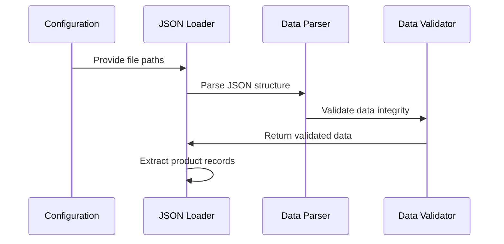
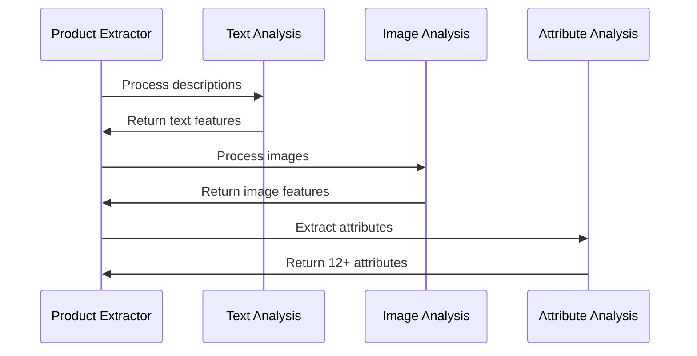
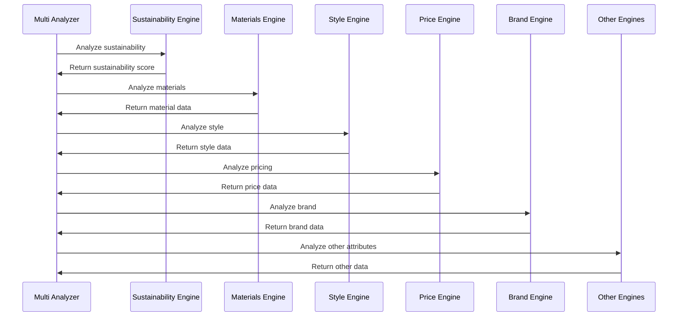
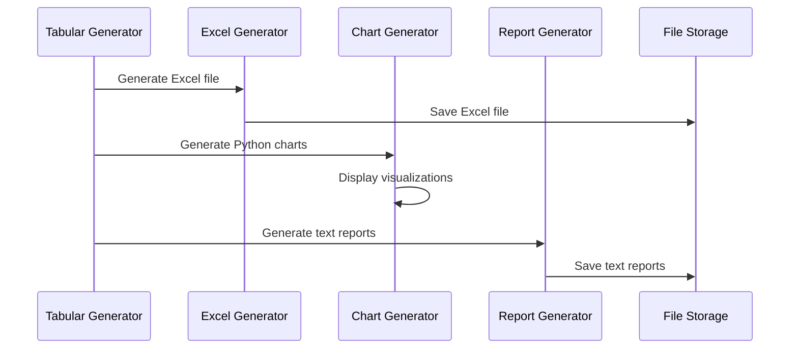

# Data Flow Architecture

## 📊 Data Flow Overview

This document describes how data flows through the Product Classification System, from input JSON files to final output reports.

## 🔄 Main Data Flow Diagram

```mermaid
flowchart TD
    %% Input Sources
    subgraph "📥 Input Sources"
        JSON1[JSON File 1<br/>Product Data]
        JSON2[JSON File 2<br/>Product Data]
        JSON3[JSON File N<br/>Product Data]
        CONFIG[Configuration File<br/>product_lists.txt]
        ENV[Environment Variables<br/>API Keys, Database URLs]
    end
    
    %% Data Loading Layer
    subgraph "🔄 Data Loading Layer"
        LOADER[json_data_loader.py<br/>JSON Parser & Validator]
        PARSER[Product Data Parser]
        VALIDATOR[Data Validator]
        EXTRACTOR[Product Extractor]
    end
    
    %% Core Processing Layer
    subgraph "⚙️ Core Processing Layer"
        MULTI[multi_product_analyzer.py<br/>Orchestration Engine]
        SINGLE[product_analyzer_from_file.py<br/>Single File Processor]
        ATTRIBUTE[Product Attribute Extractor]
    end
    
    %% Analysis Engines
    subgraph "🧠 Analysis Engines"
        SUSTAINABILITY[Sustainability Engine<br/>Environmental Impact]
        MATERIALS[Materials Engine<br/>Material Classification]
        STYLE[Style Engine<br/>Design Analysis]
        PRICE[Price Engine<br/>Value Assessment]
        BRAND[Brand Engine<br/>Reputation Analysis]
        DIMENSIONS[Dimensions Engine<br/>Size & Weight]
        CARE[Care Engine<br/>Maintenance Requirements]
        MARKET[Market Engine<br/>Target Demographics]
        SEASONAL[Seasonal Engine<br/>Trend Analysis]
        QUALITY[Quality Engine<br/>Craftsmanship Assessment]
        RECOMMENDATIONS[Recommendations Engine<br/>Usage Suggestions]
        INVENTORY[Inventory Engine<br/>Stock Analysis]
    end
    
    %% Classification Systems
    subgraph "🤖 Classification Systems"
        TEXT_CLASS[Text Classification<br/>TF-IDF Analysis]
        IMAGE_CLASS[Image Classification<br/>Visual Feature Extraction]
        COMBINED_CLASS[Combined Classification<br/>Feature Fusion]
        WORD_CLASS[Word Classification<br/>Categorization]
    end
    
    %% Recommendation System
    subgraph "🎯 Recommendation System"
        SIMILARITY[Similarity Calculator<br/>Product Comparison]
        VISUAL_DISP[Visual Display<br/>Matplotlib Interface]
        RECOMMEND[Recommendation Engine<br/>Product Suggestions]
    end
    
    %% Output Generation
    subgraph "📤 Output Generation"
        TABULAR_GEN[Tabular Generator<br/>Chart Creation]
        EXCEL_GEN[Excel Generator<br/>Multi-sheet Reports]
        CHART_GEN[Chart Generator<br/>Python Visualizations]
        REPORT_GEN[Report Generator<br/>Text Summaries]
    end
    
    %% Storage Systems
    subgraph "💾 Storage Systems"
        IMAGE_CACHE[Image Cache<br/>src/images/]
        ANALYSIS_STORE[Analysis Storage<br/>src/*_analysis.txt]
        EXCEL_STORE[Excel Storage<br/>src/product_analysis_charts.xlsx]
        FEATURE_CACHE[Feature Cache<br/>Computed Features]
    end
    
    %% Data Flow Connections
    JSON1 --> LOADER
    JSON2 --> LOADER
    JSON3 --> LOADER
    CONFIG --> MULTI
    ENV --> MULTI
    
    LOADER --> PARSER
    PARSER --> VALIDATOR
    VALIDATOR --> EXTRACTOR
    
    EXTRACTOR --> MULTI
    EXTRACTOR --> SINGLE
    
    MULTI --> ATTRIBUTE
    SINGLE --> ATTRIBUTE
    
    ATTRIBUTE --> SUSTAINABILITY
    ATTRIBUTE --> MATERIALS
    ATTRIBUTE --> STYLE
    ATTRIBUTE --> PRICE
    ATTRIBUTE --> BRAND
    ATTRIBUTE --> DIMENSIONS
    ATTRIBUTE --> CARE
    ATTRIBUTE --> MARKET
    ATTRIBUTE --> SEASONAL
    ATTRIBUTE --> QUALITY
    ATTRIBUTE --> RECOMMENDATIONS
    ATTRIBUTE --> INVENTORY
    
    EXTRACTOR --> TEXT_CLASS
    EXTRACTOR --> IMAGE_CLASS
    EXTRACTOR --> WORD_CLASS
    
    TEXT_CLASS --> COMBINED_CLASS
    IMAGE_CLASS --> COMBINED_CLASS
    WORD_CLASS --> COMBINED_CLASS
    
    COMBINED_CLASS --> SIMILARITY
    SIMILARITY --> RECOMMEND
    RECOMMEND --> VISUAL_DISP
    
    ATTRIBUTE --> TABULAR_GEN
    TABULAR_GEN --> EXCEL_GEN
    TABULAR_GEN --> CHART_GEN
    TABULAR_GEN --> REPORT_GEN
    
    IMAGE_CLASS --> IMAGE_CACHE
    RECOMMEND --> IMAGE_CACHE
    ATTRIBUTE --> ANALYSIS_STORE
    EXCEL_GEN --> EXCEL_STORE
    COMBINED_CLASS --> FEATURE_CACHE
    
    %% Styling
    classDef inputClass fill:#e3f2fd,stroke:#0277bd,stroke-width:2px
    classDef loadingClass fill:#f3e5f5,stroke:#7b1fa2,stroke-width:2px
    classDef processingClass fill:#e8f5e8,stroke:#388e3c,stroke-width:2px
    classDef analysisClass fill:#fff3e0,stroke:#f57c00,stroke-width:2px
    classDef classificationClass fill:#fce4ec,stroke:#c2185b,stroke-width:2px
    classDef recommendationClass fill:#e0f2f1,stroke:#00695c,stroke-width:2px
    classDef outputClass fill:#f1f8e9,stroke:#558b2f,stroke-width:2px
    classDef storageClass fill:#e8eaf6,stroke:#3f51b5,stroke-width:2px
    
    class JSON1,JSON2,JSON3,CONFIG,ENV inputClass
    class LOADER,PARSER,VALIDATOR,EXTRACTOR loadingClass
    class MULTI,SINGLE,ATTRIBUTE processingClass
    class SUSTAINABILITY,MATERIALS,STYLE,PRICE,BRAND,DIMENSIONS,CARE,MARKET,SEASONAL,QUALITY,RECOMMENDATIONS,INVENTORY analysisClass
    class TEXT_CLASS,IMAGE_CLASS,COMBINED_CLASS,WORD_CLASS classificationClass
    class SIMILARITY,VISUAL_DISP,RECOMMEND recommendationClass
    class TABULAR_GEN,EXCEL_GEN,CHART_GEN,REPORT_GEN outputClass
    class IMAGE_CACHE,ANALYSIS_STORE,EXCEL_STORE,FEATURE_CACHE storageClass
```



## 🔄 Detailed Data Flow Process

### **Phase 1: Data Ingestion**


### **Phase 2: Feature Extraction**


### **Phase 3: Analysis & Classification**


### **Phase 4: Output Generation**


## 📊 Data Transformation Pipeline

### **Input Data Structure**
```json
{
  "pal": {
    "style": {
      "name": "Product Name",
      "shortDescription": "Product Description",
      "materialId": [...],
      "firstMaterial": {...},
      "secondMaterial": {...},
      "price": 100,
      "brand": {...},
      "dimensions": {...}
    },
    "sku": {
      "storeFronts": [...],
      "digitalAssets": [...]
    }
  }
}
```

### **Intermediate Data Structure**
```python
{
  "id": "product_id",
  "name": "Product Name",
  "description": "Product Description",
  "category_id": "Category",
  "image": "image_url",
  "pal": {...},  # Full PAL data
  "raw_data": {...}  # Full raw data
}
```

### **Analysis Output Structure**
```python
{
  "product_id": "product_id",
  "name": "Product Name",
  "category": "Category",
  "sustainability": {
    "is_sustainable": True/False,
    "sustainability_score": 0-10,
    "sustainable_materials": [...],
    "environmental_impact": "..."
  },
  "materials": {
    "primary_materials": [...],
    "secondary_materials": [...],
    "material_quality": "..."
  },
  "style": {
    "style_era": "...",
    "design_style": "...",
    "occasions": [...]
  },
  "price_analysis": {
    "price_range": "...",
    "luxury_level": "...",
    "value_assessment": "..."
  },
  "brand_analysis": {
    "brand_name": "...",
    "brand_tier": "...",
    "reputation_score": 0-10
  },
  "inventory_analysis": {
    "sku_number": "...",
    "stock_status": "...",
    "quantity_available": 0,
    "quantity_on_hand": 0,
    "quantity_on_order": 0
  }
  # ... 8 more analysis sections
}
```

### **Final Output Structure**
```python
# Excel File Structure
{
  "Comprehensive_Analysis": DataFrame,  # All metrics
  "Inventory_Summary": DataFrame,       # Inventory focus
  "Metrics_Summary": DataFrame          # Key metrics
}

# Text Report Structure
{
  "PRODUCT ANALYSIS RESULTS": "...",
  "DETAILED PRODUCT PARAMETERS": "...",
  "SUMMARY STATISTICS": "..."
}
```

## 🎯 Data Flow Characteristics

### **Performance Optimizations**
- **Caching**: Images and features cached to avoid recomputation
- **Batch Processing**: Multiple files processed efficiently
- **Memory Management**: Large datasets processed incrementally
- **Parallel Processing**: Independent analyses can run concurrently

### **Error Handling**
- **Graceful Degradation**: System continues with missing data
- **Data Validation**: Input data validated before processing
- **Error Recovery**: Failed operations don't stop entire process
- **Logging**: Comprehensive error logging and reporting

### **Scalability Features**
- **File-Based**: No database required for basic operation
- **Configurable**: Behavior controlled by configuration files
- **Extensible**: Easy to add new analysis modules
- **Modular**: Components can be used independently

This data flow architecture ensures efficient, reliable, and scalable processing of product data from input JSON files to comprehensive output reports.
