# Product Classification System Architecture

## 🏗️ System Overview

This document describes the architecture of the Product Classification System, showing how all components interact to analyze products from JSON data and generate comprehensive reports.

## 📊 Architecture Diagram

```mermaid
graph TB
    %% Input Layer
    subgraph "📁 Input Layer"
        JSON[JSON Product Files]
        CONFIG[Configuration Files]
        ENV[Environment Variables]
    end
    
    %% Core Processing Layer
    subgraph "🔧 Core Processing Layer"
        LOADER[json_data_loader.py<br/>JSON Data Parser]
        ANALYZER[multi_product_analyzer.py<br/>Multi-File Analyzer]
        SINGLE[product_analyzer_from_file.py<br/>Single File Analyzer]
    end
    
    %% Analysis Components
    subgraph "🧠 Analysis Components"
        SUSTAINABILITY[Sustainability Analysis]
        MATERIALS[Materials Analysis]
        STYLE[Style Analysis]
        PRICE[Price Analysis]
        BRAND[Brand Analysis]
        DIMENSIONS[Dimensions Analysis]
        CARE[Care Analysis]
        MARKET[Market Analysis]
        SEASONAL[Seasonal Analysis]
        QUALITY[Quality Assessment]
        RECOMMENDATIONS[Usage Recommendations]
        INVENTORY[Inventory Analysis]
    end
    
    %% Classification Systems
    subgraph "🤖 Classification Systems"
        TEXT[simple_text_classifier.py<br/>Text Classification]
        IMAGE[image_classifier_json.py<br/>Image Classification]
        COMBINED[combined_classifier_json.py<br/>Combined Classification]
        WORDS[categorize_words_json.py<br/>Word Categorization]
        BASIC[basic_text_analyzer.py<br/>Basic Text Analysis]
    end
    
    %% Recommendation System
    subgraph "🎯 Recommendation System"
        RECOMMENDER[product_recommender_json.py<br/>Visual Recommendations]
        SIMILARITY[Similarity Engine]
        VISUAL[Visual Display]
    end
    
    %% Output Generation
    subgraph "📈 Output Generation"
        TABULAR[tabular_product_analyzer.py<br/>Tabular Charts]
        EXCEL[Excel Export]
        CHARTS[Python Charts]
        REPORTS[Text Reports]
    end
    
    %% Storage Layer
    subgraph "💾 Storage Layer"
        CACHE[Image Cache<br/>src/images/]
        ANALYSIS[Analysis Reports<br/>src/*_analysis.txt]
        EXCEL_OUT[Excel Files<br/>src/product_analysis_charts.xlsx]
    end
    
    %% Data Flow Connections
    JSON --> LOADER
    CONFIG --> ANALYZER
    ENV --> ANALYZER
    
    LOADER --> ANALYZER
    LOADER --> SINGLE
    
    ANALYZER --> SUSTAINABILITY
    ANALYZER --> MATERIALS
    ANALYZER --> STYLE
    ANALYZER --> PRICE
    ANALYZER --> BRAND
    ANALYZER --> DIMENSIONS
    ANALYZER --> CARE
    ANALYZER --> MARKET
    ANALYZER --> SEASONAL
    ANALYZER --> QUALITY
    ANALYZER --> RECOMMENDATIONS
    ANALYZER --> INVENTORY
    
    LOADER --> TEXT
    LOADER --> IMAGE
    LOADER --> COMBINED
    LOADER --> WORDS
    LOADER --> BASIC
    
    ANALYZER --> RECOMMENDER
    RECOMMENDER --> SIMILARITY
    RECOMMENDER --> VISUAL
    
    ANALYZER --> TABULAR
    TABULAR --> EXCEL
    TABULAR --> CHARTS
    TABULAR --> REPORTS
    
    IMAGE --> CACHE
    RECOMMENDER --> CACHE
    ANALYZER --> ANALYSIS
    TABULAR --> EXCEL_OUT
    
    %% Styling
    classDef inputClass fill:#e1f5fe,stroke:#01579b,stroke-width:2px
    classDef coreClass fill:#f3e5f5,stroke:#4a148c,stroke-width:2px
    classDef analysisClass fill:#e8f5e8,stroke:#1b5e20,stroke-width:2px
    classDef classificationClass fill:#fff3e0,stroke:#e65100,stroke-width:2px
    classDef recommendationClass fill:#fce4ec,stroke:#880e4f,stroke-width:2px
    classDef outputClass fill:#e0f2f1,stroke:#004d40,stroke-width:2px
    classDef storageClass fill:#f1f8e9,stroke:#33691e,stroke-width:2px
    
    class JSON,CONFIG,ENV inputClass
    class LOADER,ANALYZER,SINGLE coreClass
    class SUSTAINABILITY,MATERIALS,STYLE,PRICE,BRAND,DIMENSIONS,CARE,MARKET,SEASONAL,QUALITY,RECOMMENDATIONS,INVENTORY analysisClass
    class TEXT,IMAGE,COMBINED,WORDS,BASIC classificationClass
    class RECOMMENDER,SIMILARITY,VISUAL recommendationClass
    class TABULAR,EXCEL,CHARTS,REPORTS outputClass
    class CACHE,ANALYSIS,EXCEL_OUT storageClass
```



## 🔄 Data Flow Process

### 1. **Input Processing**
- **JSON Files**: Product data from various sources
- **Configuration**: Product lists and settings
- **Environment**: API keys and database connections

### 2. **Core Analysis**
- **Data Loading**: Parse JSON files and extract product information
- **Multi-File Processing**: Analyze products across multiple files
- **Attribute Extraction**: Extract 12+ different product attributes

### 3. **Classification & Analysis**
- **Text Analysis**: Process product descriptions and names
- **Image Analysis**: Extract visual features from product images
- **Combined Analysis**: Merge text and image features
- **Comprehensive Analysis**: Extract sustainability, materials, style, pricing, etc.

### 4. **Recommendation Engine**
- **Similarity Calculation**: Compare products using multiple metrics
- **Visual Display**: Show recommendations with images and explanations
- **Interactive Interface**: Matplotlib-based product comparison

### 5. **Output Generation**
- **Tabular Charts**: Comprehensive Excel reports with multiple sheets
- **Python Visualizations**: Interactive charts and graphs
- **Text Reports**: Detailed analysis summaries
- **Image Caching**: Automatic image downloading and storage

## 🏛️ Component Architecture

### **Core Components**
- **json_data_loader.py**: Central data parsing and loading
- **multi_product_analyzer.py**: Main orchestration engine
- **product_analyzer_from_file.py**: Single-file analysis engine

### **Analysis Engines**
- **12 Analysis Modules**: Sustainability, Materials, Style, Price, Brand, Dimensions, Care, Market, Seasonal, Quality, Recommendations, Inventory
- **Flexible Extraction**: Handles various JSON formats and data structures
- **Error Handling**: Graceful handling of missing or malformed data

### **Classification Systems**
- **Text Classification**: TF-IDF and word frequency analysis
- **Image Classification**: Feature extraction using PIL and numpy
- **Combined Classification**: Merged text and image features
- **No TensorFlow Required**: Lightweight alternatives for all ML tasks

### **Output Systems**
- **Excel Export**: Multi-sheet workbooks with comprehensive data
- **Python Charts**: Interactive matplotlib visualizations
- **Text Reports**: Detailed analysis summaries
- **Visual Recommendations**: Product comparison with images

## 🔧 Technical Architecture

### **Design Patterns**
- **Modular Design**: Each component has a single responsibility
- **Plugin Architecture**: Easy to add new analysis modules
- **Configuration-Driven**: Behavior controlled by config files
- **Error Resilient**: Continues processing even with data issues

### **Data Flow**
1. **Input** → JSON files and configuration
2. **Processing** → Multi-stage analysis pipeline
3. **Storage** → Cached images and generated reports
4. **Output** → Excel files, charts, and text reports

### **Scalability**
- **File-Based**: No database required for basic operation
- **Caching**: Images and features cached for performance
- **Batch Processing**: Handles multiple files efficiently
- **Memory Efficient**: Processes files incrementally

## 🎯 Key Features

### **Flexibility**
- **Multiple Input Formats**: Handles various JSON structures
- **Configurable Analysis**: Customizable analysis parameters
- **Extensible**: Easy to add new analysis modules

### **Performance**
- **Image Caching**: Avoids re-downloading images
- **Feature Caching**: Reuses computed features
- **Batch Processing**: Efficient multi-file processing

### **User Experience**
- **Visual Interface**: Matplotlib-based product recommendations
- **Comprehensive Reports**: Detailed Excel and text outputs
- **Easy Configuration**: Simple file-based configuration

## 📁 File Organization

```
architecture/
├── system_architecture.md    # This document
├── component_diagram.md      # Detailed component interactions
└── data_flow.md             # Data flow documentation
```

This architecture ensures a robust, scalable, and maintainable product classification system that can handle various data sources and provide comprehensive analysis outputs.
